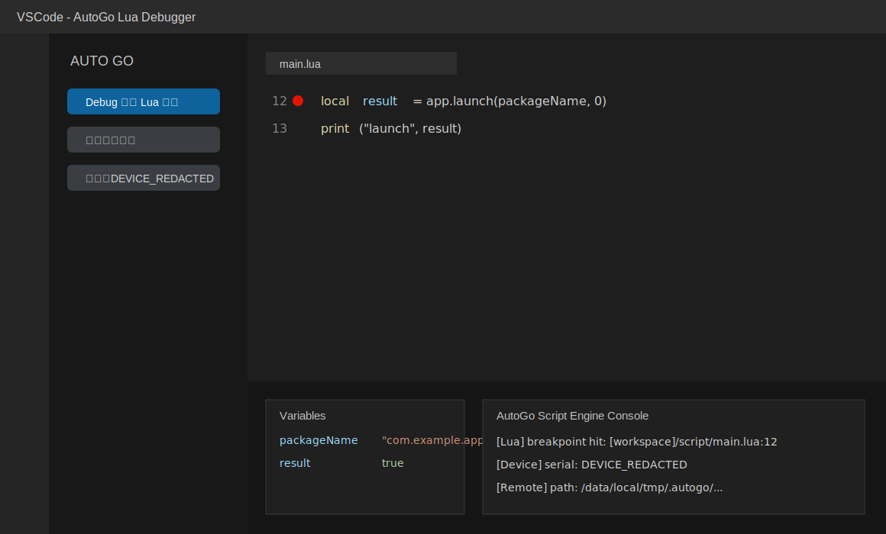
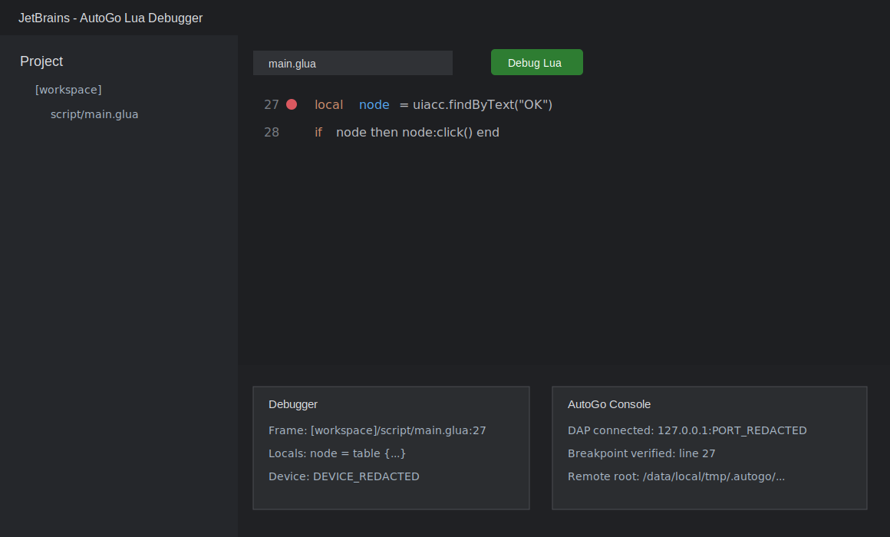

# AutoGo Debugger

AutoGo ScriptEngine Debugger v1.0.0 已发布，项目地址：

<https://github.com/ZingYao/autogo_scriptengine_debugger/releases/tag/v1.0.0>

当前推荐使用 VSCode 或 JetBrains 插件中的 AutoGo Debugger。插件已经内置调试工具能力，通常不需要再手动下载命令行工具。

## 当前支持范围

| 能力 | Lua / GLua | JavaScript |
| --- | --- | --- |
| 脚本运行 | 支持 | 支持 |
| 日志查看 | 支持 | 支持 |
| 断点调试 | 支持 | 暂不支持 |
| 单步调试 | 支持 | 暂不支持 |
| 调用栈 | 支持 | 暂不支持 |
| 变量查看 | 支持 | 暂不支持 |
| 变量修改 | 依赖运行时能力 | 暂不支持 |

Debugger 当前只提供 Lua/GLua 代码的 DAP 调试。JavaScript 代码可以通过插件运行、部署和查看日志，但不能使用断点、单步、调用栈或变量面板。

## IDE 集成

### VSCode

VSCode 插件提供 AutoGo Activity Bar 入口和调试按钮。打开 `.lua` 或 `.glua` 文件后，使用 AutoGo 面板中的运行或调试入口即可。



典型流程：

1. 打开 AutoGo 项目根目录。
2. 确认 AutoGo 插件已识别项目和设备。
3. 打开需要调试的 `.lua` 或 `.glua` 文件。
4. 在行号左侧设置断点。
5. 点击 AutoGo 面板中的 Debug 当前文件。
6. 调试启动后使用 VSCode 原生调试面板查看变量、调用栈和断点。

### JetBrains

JetBrains 插件支持 IDEA、GoLand 等 IntelliJ Platform IDE。打开 `.lua` 或 `.glua` 文件后，可通过顶部 AutoGo 菜单、工具栏或运行配置启动调试。



典型流程：

1. 打开 AutoGo 项目根目录。
2. 在 AutoGo 设置中确认 AG、ADB、Go、GLuac 路径已自动发现或手动配置。
3. 打开需要调试的 `.lua` 或 `.glua` 文件。
4. 在编辑器左侧设置断点。
5. 使用 AutoGo Debug 当前文件。
6. 调试启动后使用 JetBrains 原生 Debug 工具窗口查看栈帧、变量和日志。

## 调试流程

IDE 插件在启动 Lua/GLua 调试时会完成以下工作：

1. 解析当前入口文件的静态 `require` 依赖闭包。
2. 将入口文件和依赖文件增量同步到移动端远程引擎。
3. 启动或复用移动端 AutoGo ScriptEngine 远程引擎。
4. 创建 DAP 会话并映射本地源码路径与设备端 release 路径。
5. 使用 IDE 原生 Debug UI 执行断点、单步、继续、暂停、变量查看等操作。

动态 `require` 无法在调试前完全推断。遇到动态依赖时，需要把额外脚本文件加入项目同步配置，或改为静态 `require`。

## Lua DAP 能力

当前 Lua/GLua 调试支持：

- 文件行断点。
- `continue`、`pause`、`next`、`stepIn`、`stepOut`。
- `threads`、`stackTrace`、`scopes`、`variables`。
- 局部变量、Upvalues 和 Globals 快照。
- 异常事件回传。
- 源码路径映射。
- 多文件 `require` 依赖调试。

边界说明：

- Go 注入方法内部不能按 Lua 行单步，只能停在 Lua 调用前后。
- 使用 `gluac -s` 去除调试信息后的字节码不能做源码级调试。
- JavaScript 调试未实现；不要把 JS 运行入口配置为断点调试入口。

示例代码见：

```text
examples/lua_engine/debugger
```

## 独立工具下载

IDE 插件已内置 debugger 使用路径。以下场景才需要单独下载 Release：

- 需要在终端中独立运行 TUI/CLI 工具。
- 需要验证 debugger 工具自身行为。
- IDE 插件不可用，需要临时使用命令行流程。

Release 下载地址：

<https://github.com/ZingYao/autogo_scriptengine_debugger/releases/tag/v1.0.0>

v1.0.0 提供的平台包：

| 平台 | 文件 |
| --- | --- |
| Windows x64 | `AutoGoScriptEngineDebugger-Windows.zip` |
| macOS Apple Silicon | `AutoGoScriptEngineDebugger-macOS-ARM.tar.gz` |
| macOS Intel | `AutoGoScriptEngineDebugger-macOS-AMD.tar.gz` |

macOS 解压后如遇到执行权限问题：

```bash
chmod +x AutoGoScriptEngineDebugger*
```

## 常见问题

### JavaScript 能不能断点调试？

不能。当前 debugger 只支持 Lua/GLua 的 DAP 调试。JavaScript 只支持运行、部署和日志查看。

### 为什么断点没有命中？

优先检查：

1. 当前文件是否为 `.lua` 或 `.glua`。
2. 调试启动前入口文件和依赖文件是否已成功同步。
3. 断点行是否是可执行 Lua 语句。
4. 是否使用了 strip 后的 `.gluac` 字节码。
5. 动态 `require` 的文件是否已加入额外同步配置。

### 截图中为什么没有真实路径？

文档截图已做脱敏处理。实际 IDE 中会显示你的本地项目路径、设备序列号和运行目录；对外反馈问题时请同样打码这些信息。

